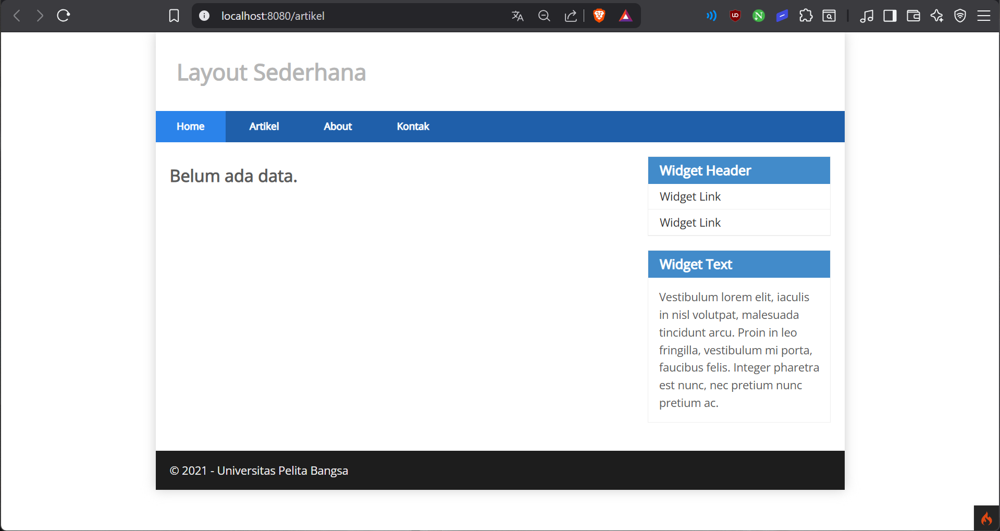
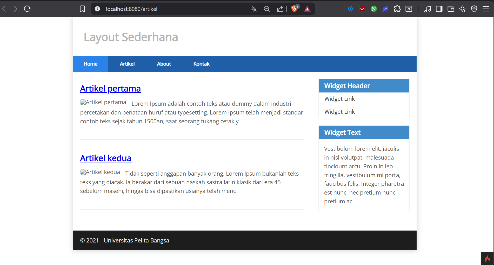
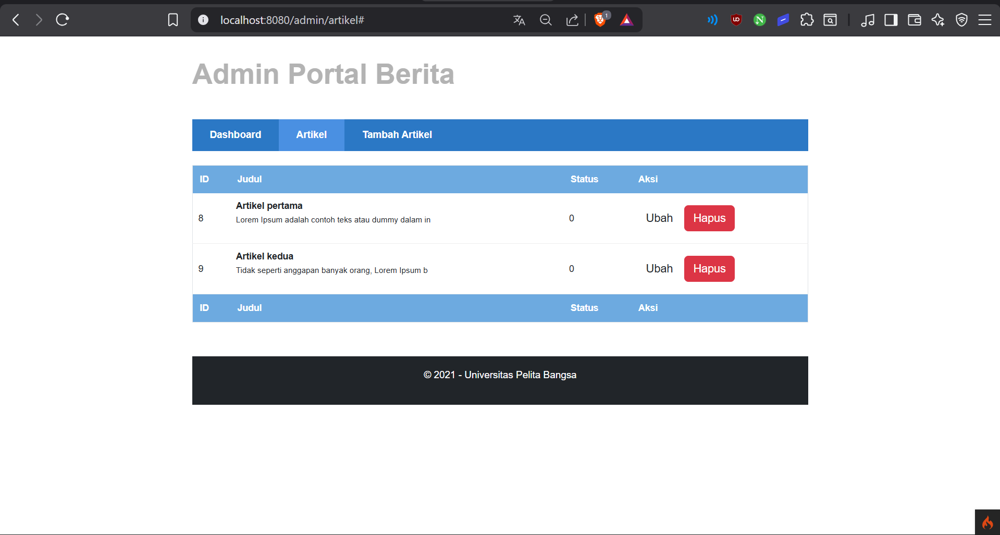
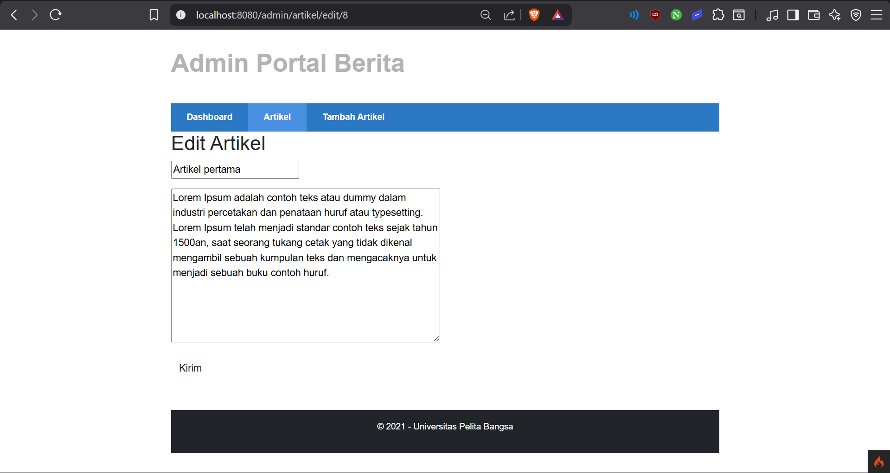
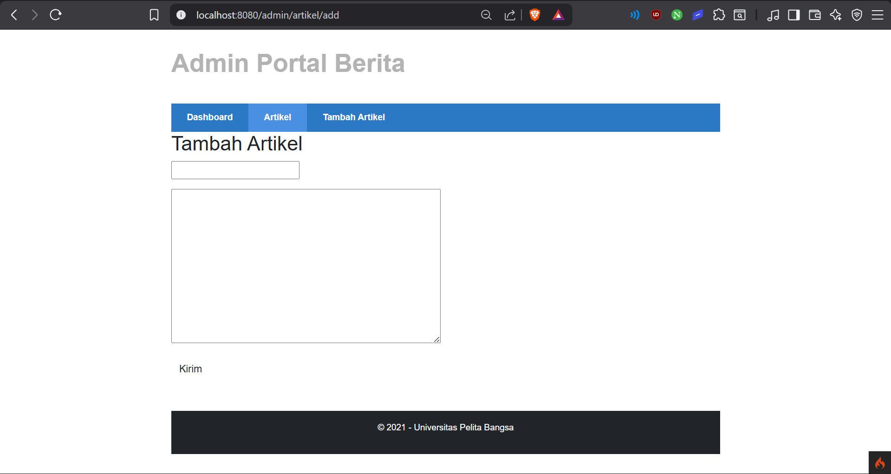

# Praktikum 2: Framework Lanjutan (CRUD)

## Nama: Syafarudiansya
## NIM: 312410381
## Kelas: I241A

# Praktikum Web 2 - CRUD Artikel (CodeIgniter 4)

## Deskripsi

Project ini merupakan implementasi aplikasi **CRUD (Create, Read, Update, Delete)** menggunakan framework **CodeIgniter 4**.
Aplikasi ini digunakan untuk mengelola data artikel sederhana berbasis web.

---

## Tujuan Praktikum

* Memahami konsep **Model** pada CodeIgniter 4
* Memahami konsep **CRUD (Create, Read, Update, Delete)**
* Mampu membuat aplikasi web sederhana menggunakan framework

---

## Cara Menjalankan Project

1. **Buat database dan tabel**

   ```sql
   CREATE DATABASE lab_ci4;

   CREATE TABLE artikel (
     id INT(11) auto_increment,
     judul VARCHAR(200) NOT NULL,
     isi TEXT,
     gambar VARCHAR(200),
     status TINYINT(1) DEFAULT 0,
     slug VARCHAR(200),
     PRIMARY KEY(id)
   );
   ```

2. **Konfigurasi file `.env`**

   ```env
   database.default.hostname = localhost
   database.default.database = lab_ci4
   database.default.username = root
   database.default.password =
   database.default.DBDriver = MySQLi
   ```

3. **Akses di browser**

   ```
   http://localhost:8080/artikel
   ```

---

## Fitur Aplikasi

### 1. Menampilkan Artikel (Read)

* URL: `/artikel`
* Menampilkan semua data artikel dari database

### 2. Detail Artikel

* URL: `/artikel/{slug}`
* Menampilkan isi lengkap artikel berdasarkan slug

### 3. Halaman Admin

* URL: `/admin/artikel`
* Menampilkan daftar artikel dan aksi:

  * Edit
  * Hapus

### 4. Tambah Artikel (Create)

* URL: `/admin/artikel/add`
* Input data artikel baru

### ✏️ 5. Edit Artikel (Update)

* URL: `/admin/artikel/edit/{id}`
* Mengubah data artikel

### ❌ 6. Hapus Artikel (Delete)

* URL: `/admin/artikel/delete/{id}`
* Menghapus artikel dari database

---

## 🔀 Routing

```php
$routes->get('/artikel', 'Artikel::index');
$routes->get('/artikel/(:any)', 'Artikel::view/$1');

$routes->group('admin', function($routes) {
    $routes->get('artikel', 'Artikel::admin_index');
    $routes->add('artikel/add', 'Artikel::add');
    $routes->add('artikel/edit/(:any)', 'Artikel::edit/$1');
    $routes->get('artikel/delete/(:any)', 'Artikel::delete/$1');
});
```

---

## Screenshot

Tambahkan screenshot berikut:

* Halaman utama artikel
  
  
  
* Detail artikel


  
* Halaman admin



* Form tambah artikel



* Form edit artikel




---
